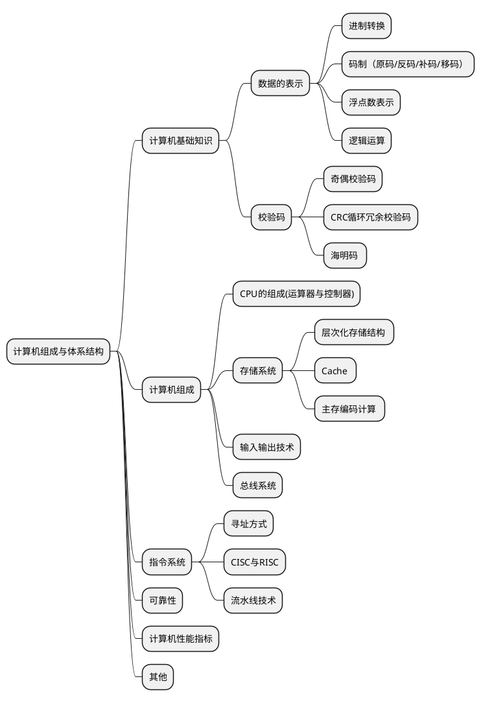

```plantuml
@startmindmap
* 计算机组成与体系结构
** 计算机基础知识
*** 数据的表示
**** 进制转换
**** 码制（原码/反码/补码/移码）
**** 浮点数表示
**** 逻辑运算

*** 校验码
**** 奇偶校验码
**** CRC循环冗余校验码
**** 海明码 

** 计算机组成
*** CPU的组成(运算器与控制器)
*** 存储系统
**** 层次化存储结构 
**** Cache 
**** 主存编码计算 
*** 输入输出技术
*** 总线系统

** 指令系统
*** 寻址方式
*** CISC与RISC
*** 流水线技术

** 可靠性
** 计算机性能指标
** 其他

@endmindmap
```

