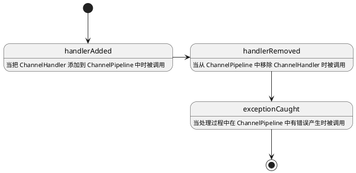

```plantuml
@startuml

[*] --> handlerAdded
handlerAdded : 当把 ChannelHandler 添加到 ChannelPipeline 中时被调用
handlerAdded -> handlerRemoved
handlerRemoved :当从 ChannelPipeline 中移除 ChannelHandler 时被调用
handlerRemoved --> exceptionCaught
exceptionCaught : 当处理过程中在 ChannelPipeline 中有错误产生时被调用
exceptionCaught --> [*]


@enduml

```