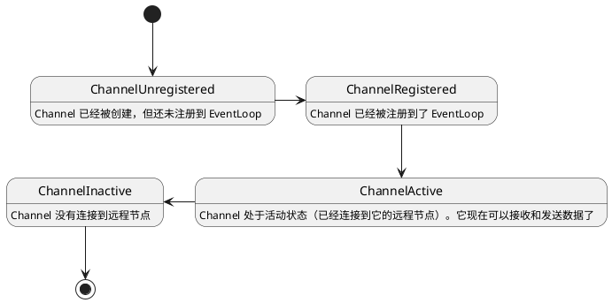

```plantuml
@startuml

[*] --> ChannelUnregistered
ChannelUnregistered : Channel 已经被创建，但还未注册到 EventLoop

ChannelUnregistered -> ChannelRegistered
ChannelRegistered : Channel 已经被注册到了 EventLoop
ChannelRegistered --> ChannelActive
ChannelActive -l-> ChannelInactive
ChannelActive : Channel 处于活动状态（已经连接到它的远程节点）。它现在可以接收和发送数据了
ChannelInactive --> [*]
ChannelInactive : Channel 没有连接到远程节点


@enduml

```