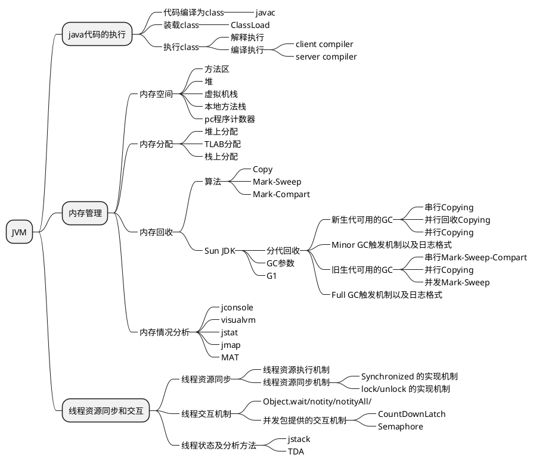

#### JVM
1. 基本概念
JVM是可运行java代码的假想计算机，包括一套字节码指令集、一组寄存器、一个栈、一个垃圾回收堆和一个存储方法域。JVM是运行在操作系统之上的，它与硬件没有直接的交互。
2. 运行过程
2）Java源文件——>编译器——>字节码
3）字节码——>JVM——>机器码

#### 运行时数据区（JMM内存分区）
分为两类，线程共享，线程私有
1. 线程共享
- 堆
- 字符串常量池
- 直接内存
2. 线程私有
- 程序计数器
记录线程的执行位置
- 虚拟机栈
存放栈帧（其实就是方法），参数，方法返回地址
- 本地方法栈
JNI 的方法

#### 对象的创建
1. 类加载检查
2. 分配内存
3. 初始化零值
4. 设置对象头
5. 执行init方法

#### 对象的内存布局
对象头，实例数据，对齐填充

##### 对象头
标记字段：hashcode，对象年龄，锁状态。。。\
类型指针：具体是哪个类的实例

### JVM内存区域（运行时数据区）
• 线程私有：程序计数器、Java虚拟机栈、本地方法栈。
• 线程共享：Java堆、方法区（元空间）。
• 重点理解每个区域的作用、可能出现的异常（如StackOverflowError， OOM）。
面试题：
• Java 8之前和之后方法区的区别？（永久代 vs 元空间）
• 元空间使用什么内存？会触发GC吗？

### 垃圾回收基础
• 如何判断对象可回收？引用计数法、可达性分析算法。
• 对象引用类型：强引用、软引用、弱引用、虚引用。
实践：写一段代码，观察软引用在内存不足时被回收的情况。
面试题：
• GC Roots包括哪些元素？
1. 栈、常量，静态变量引用的对象
2. syn锁住的对象

### 垃圾回收算法
• 标记-清除、标记-复制、标记-整理。
• 分代收集理论：年轻代、老年代。
面试题：
• 为什么HotSpot虚拟机分为新生代和老年代？
• 标记-复制算法是如何工作的？有什么优缺点？

面试题：
• 对象什么时候会进入老年代？
• 一个对象的内存分配流程是怎样的？

### 字节码、类加载与内存分析
目标：理解Java代码如何转换为字节码并被JVM执行，掌握类加载机制，并学会使用基础性能工具。
#### 字节码指令
• 使用 javap反解析Class文件。
• 了解方法调用指令（invokevirtual, invokestatic等）。
• 了解 i++和 ++i的字节码区别。
实践：写一个简单的 synchronized方法，用 javap -c -v查看 monitorenter和 monitorexit 指令。
### 类加载过程
• 加载、链接（验证、准备、解析）、初始化。
• 重点理解 <clinit>()和 <init>()方法。
面试题：
• 类初始化的触发时机？
• 准备阶段和初始化阶段对静态变量赋值的区别？
### 类加载器与双亲委派
• 启动类、扩展类、应用类加载器。
• 双亲委派模型的工作流程和作用。
• 如何打破双亲委派？（如JDBC， Tomcat）。

• 双亲委派模型是什么？有什么好处？
• 如何自定义一个类加载器？
### JVM性能监控工具
• 命令行工具：jps, jstat, jinfo, jmap。
• 学习使用 jstat -gc观察GC情况。
实践：对你写的一个小程序，使用 jps查看进程ID，然后用 jstat -gc <pid> 1000每隔1秒打印一次GC情况。
### 堆内存分析
• 使用 jmap生成堆转储文件。
• 使用可视化工具（如JVisualVM, JProfiler, Eclipse MAT）分析堆转储，查找内存泄漏。
实践：写一段制造内存泄漏的代码（比如用静态Map缓存），然后用 jmapdump出来，用MAT分析。
面试题：
• 如何排查OOM问题？思路是什么？
• Tomcat为什么需要破坏双亲委派？
### 运行时栈帧结构
• 局部变量表、操作数栈、动态链接、方法返回地址。
• 方法调用的字节码指令。
面试题：
• 举例说明什么是动态链接？
### Java内存模型（JMM）
• 主内存与工作内存。
• 内存间交互操作（lock, unlock, read, load, use等）。
• volatile关键字的内存语义。
面试题：
• volatile能保证原子性吗？
• volatile的可见性和禁止指令重排序是如何实现的？
### 线程与锁优化
• Java线程的实现模型。
• 锁优化：偏向锁、轻量级锁、重量级锁、锁升级过程。
实践：使用 jstack命令查看一个Java进程的线程状态和锁持有情况。
面试题：
• synchronized锁升级的过程是怎样的？
### 编译期与运行期优化
• 早期（编译期）优化：语法糖（泛型擦除、自动装箱拆箱）。
• 晚期（运行期）优化：即时编译器（C1, C2）， 分层编译。
面试题：
• 解释执行和编译执行的区别？
• 什么是方法内联？
### JVM调优实战思路
• 调优目标：停顿时间、吞吐量。
• 常见问题分析思路：CPU过高、OOM、GC频繁。
面试题：
• 如果线上应用GC频繁，你的排查思路是什么？
• 如何给一个新生业务设定JVM参数？
• 画图说明锁升级流程。
• 梳理JMM如何保证可见性、有序性。
• 默写JVM内存结构图、垃圾回收器分类图。
• 复述类加载全过程和双亲委派模型。
• 复述JMM和volatile原理。
• 复述synchronized锁升级过程。
• 在网上搜索“JVM面试题”，尝试回答所有问题。
• 重点准备：OOM排查、GC调优、类加载器、内存模型。

