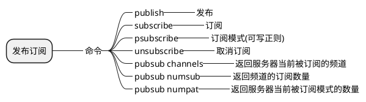

```plantuml
@startmindmap
* 发布订阅
**_ 命令
***_ publish
****_ 发布
***_ subscribe
****_ 订阅
***_ psubscribe
****_ 订阅模式(可写正则)
***_ unsubscribe
****_ 取消订阅
***_ pubsub channels
****_ 返回服务器当前被订阅的频道
***_ pubsub numsub
****_ 返回频道的订阅数量
***_ pubsub numpat
****_ 返回服务器当前被订阅模式的数量

@endmindmap
```

<!-- @import "./image/发布订阅_1.png" -->
