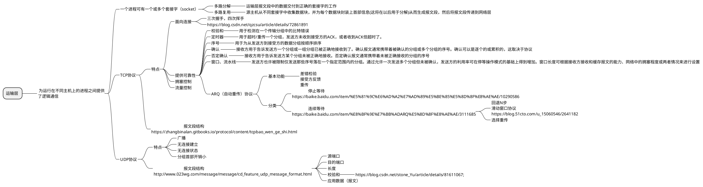

```plantuml
@startmindmap
* 运输层 
**_: 为运行在不同主机上的进程之间提供
了逻辑通信;
***_ 一个进程可有一个或多个套接字（socket）
****_ 多路分解
*****_ 运输层报文段中的数据交付到正确的套接字的工作
****_ 多路复用
*****_ 源主机从不同套接字中收集数据块，并为每个数据块封装上首部信息(这将在以后用于分解)从而生成报文段，然后将报文段传递到网络层
***_ TCP协议
****_ 特点
*****_ 面向连接
******_ 三次握手，四次挥手
******_ https://blog.csdn.net/qzcsu/article/details/72861891
*****_ 提供可靠性
******_ 校验和
*******_ 用于检测在一个传输分组中的比特错误
******_ 定时器
*******_ 用于超时/重传一个分组，发送方未收到接受方的ACK，或者收到ACK但超时了。
******_ 序号
*******_ 用于为从发送方到接受方的数据分组按顺序排序
******_ 确认 
*******_ 接收方用于告诉发送方一个分组或一组分组已被正确地接收到了。确认报文通常携带着被确认的分组或多个分组的序号。确认可以是逐个的或累积的，这取决于协议
******_ 否定确认 
*******_ 接收方用于告诉发送方某个分组未被正确地接收。否定确认报文通常携带着未被正确接收的分组的序号
******_ 窗口、流水线
*******_ 发送方也许被限制仅发送那些序号落在一个指定范围内的分组。通过允许一次发送多个分组但未被确认，发送方的利用率可在停等操作模式的基础上得到增加。窗口长度可根据接收方接收和缓存报文的能力、网络中的拥塞程度或两者情况来进行设置

******_ ARQ（自动重传）协议

*******_ 基本功能
********_: 
差错检验
接受方反馈
重传;
*******_ 分类
********_:               停止等待
https://baike.baidu.com/item/%E5%81%9C%E6%AD%A2%E7%AD%89%E5%BE%85%E5%8D%8F%E8%AE%AE/10290586;
********_:               连续等待
https://baike.baidu.com/item/%E8%BF%9E%E7%BB%ADARQ%E5%8D%8F%E8%AE%AE/3111685;
*********_:回退N步
滑动窗口协议
https://blog.51cto.com/u_15060546/2641182;
*********_ 选择重传


*****_ 拥塞控制
*****_ 流量控制
****_:                              报文段结构
https://zhangbinalan.gitbooks.io/protocol/content/tcpbao_wen_ge_shi.html;
***_ UDP协议 
****_ 特点
*****_ 广播
*****_ 无连接建立
*****_ 无连接状态
*****_ 分组首部开销小
****_: 
                            报文段结构
http://www.023wg.com/message/message/cd_feature_udp_message_format.html;

*****_ 源端口
*****_ 目的端口
*****_ 长度
*****_ 校验和
******_ https://blog.csdn.net/stone_Yu/article/details/81611067;
*****_ 应用数据（报文）

@endmindmap

```