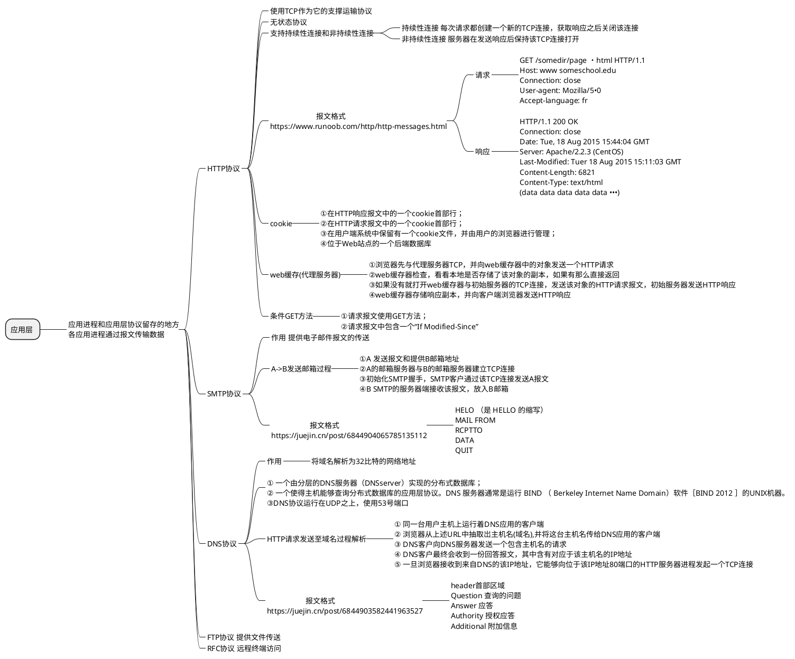

```plantuml
@startmindmap
* 应用层 
**_:应用进程和应用层协议留存的地方
各应用进程通过报文传输数据;
***_ HTTP协议 
****_ 使用TCP作为它的支撑运输协议
****_ 无状态协议
****_ 支持持续性连接和非持续性连接
*****_ 持续性连接 每次请求都创建一个新的TCP连接，获取响应之后关闭该连接
*****_ 非持续性连接 服务器在发送响应后保持该TCP连接打开
****_: 
                        报文格式
https://www.runoob.com/http/http-messages.html
;

*****_ 请求 
******_: 
GET /somedir/page ・html HTTP/1.1    
Host: www someschool.edu
Connection: close
User-agent: Mozilla/5•0
Accept-language: fr;

*****_ 响应 
******_: 
HTTP/1.1 200 OK
Connection: close
Date: Tue, 18 Aug 2015 15:44:04 GMT
Server: Apache/2.2.3 (CentOS)
Last-Modified: Tuer 18 Aug 2015 15:11:03 GMT
Content-Length: 6821
Content-Type: text/html
(data data data data data •••);

****_ cookie
*****_: 
①在HTTP响应报文中的一个cookie首部行；
②在HTTP请求报文中的一个cookie首部行；
③在用户端系统中保留有一个cookie文件，并由用户的浏览器进行管理；
④位于Web站点的一个后端数据库;

****_ web缓存(代理服务器)
*****_: 
①浏览器先与代理服务器TCP，并向web缓存器中的对象发送一个HTTP请求
②web缓存器检查，看看本地是否存储了该对象的副本，如果有那么直接返回
③如果没有就打开web缓存器与初始服务器的TCP连接，发送该对象的HTTP请求报文，初始服务器发送HTTP响应
④web缓存器存储响应副本，并向客户端浏览器发送HTTP响应;

****_ 条件GET方法
*****_: 
①请求报文使用GET方法；
②请求报文中包含一个“If Modified-Since”;

***_ SMTP协议 
****_ 作用 提供电子邮件报文的传送

****_ A->B发送邮箱过程
*****_:
①A 发送报文和提供B邮箱地址
②A的邮箱服务器与B的邮箱服务器建立TCP连接
③初始化SMTP握手，SMTP客户通过该TCP连接发送A报文
④B SMTP的服务器端接收该报文，放入B邮箱;
****_:                
                    报文格式
https://juejin.cn/post/6844904065785135112;
*****_:
HELO （是 HELLO 的缩写）
MAIL FROM 
RCPTTO
DATA
QUIT;

***_ DNS协议 
****_ 作用 
*****_ 将域名解析为32比特的网络地址

****_: 
① 一个由分层的DNS服务器（DNSserver）实现的分布式数据库；
② 一个使得主机能够查询分布式数据库的应用层协议。DNS 服务器通常是运行 BIND （ Berkeley Internet Name Domain）软件［BIND 2012 ］的UNIX机器。
③DNS协议运行在UDP之上，使用53号端口;
****_ HTTP请求发送至域名过程解析
*****_:
① 同一台用户主机上运行着DNS应用的客户端
② 浏览器从上述URL中抽取岀主机名(域名),并将这台主机名传给DNS应用的客户端
③ DNS客户向DNS服务器发送一个包含主机名的请求
④ DNS客户最终会收到一份回答报文，其中含有对应于该主机名的IP地址
⑤ 一旦浏览器接收到来自DNS的该IP地址，它能够向位于该IP地址80端口的HTTP服务器进程发起一个TCP连接;
****_: 
                    报文格式
https://juejin.cn/post/6844903582441963527;

*****_: 
header首部区域
Question 查询的问题
Answer 应答
Authority 授权应答
Additional 附加信息;

***_ FTP协议 提供文件传送
***_ RFC协议 远程终端访问

@endmindmap
```